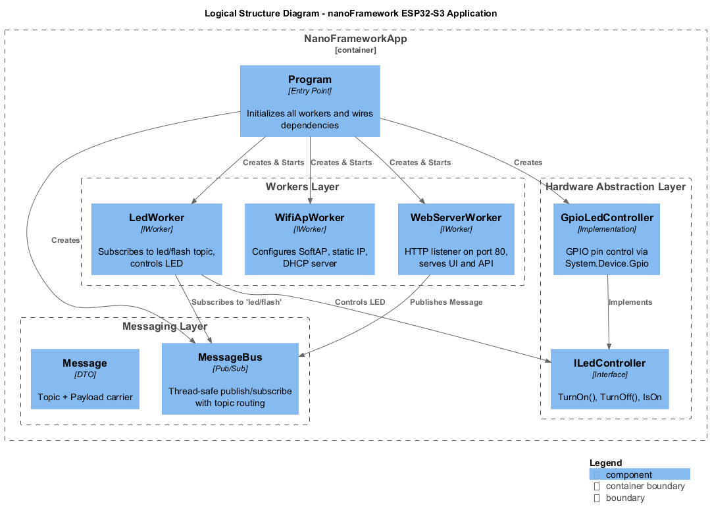
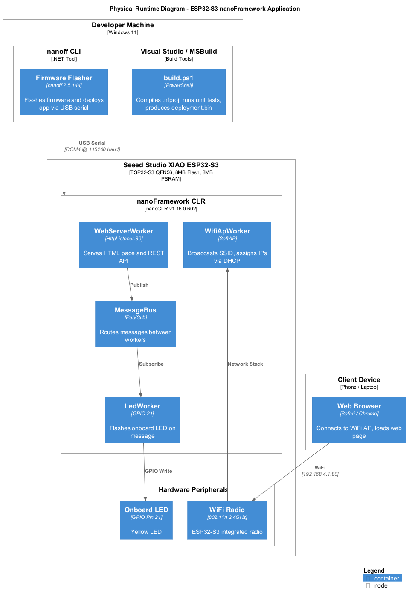
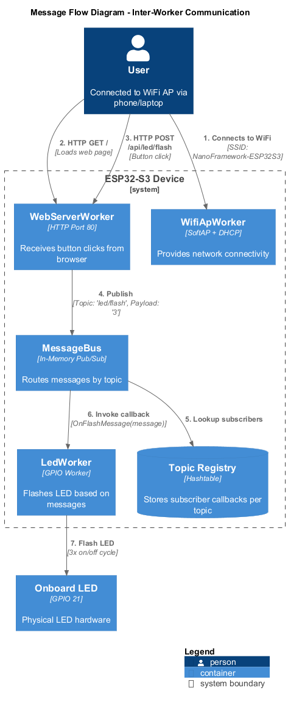
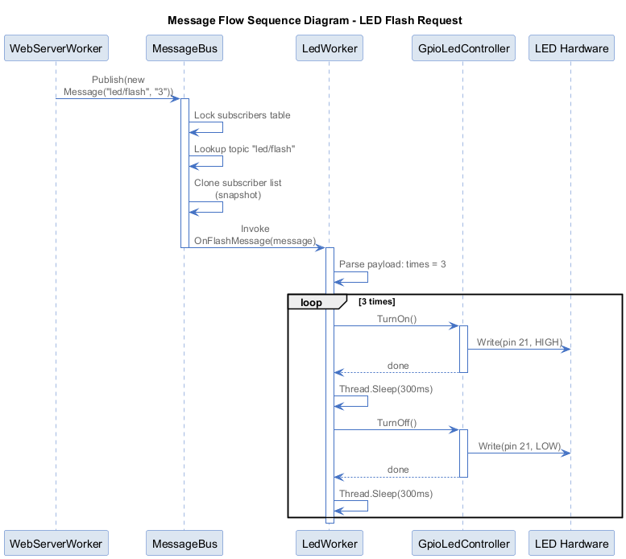
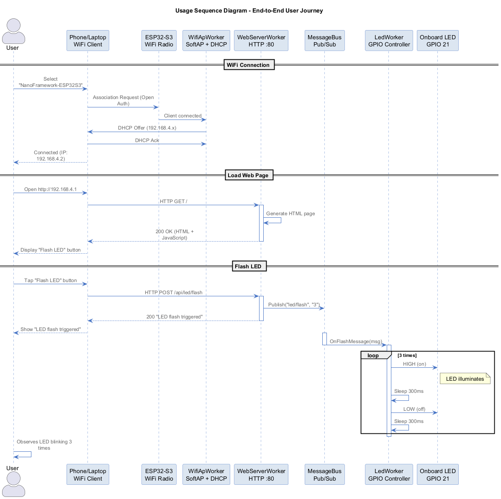
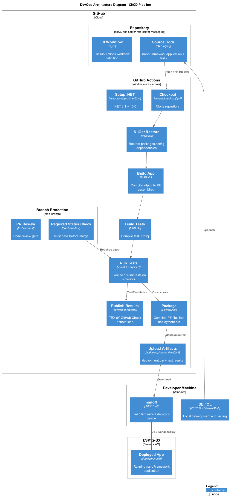

# ESP32-S3 WiFi Server + HTTP Server + Messaging

[](https://github.com/jeffreypalermo/esp32-wifi-server-http-server-messaging/actions/workflows/ci.yml)

A complete embedded IoT application built with [.NET nanoFramework](https://nanoframework.net/) for the **Seeed Studio XIAO ESP32-S3**. The device runs as a standalone WiFi access point with an HTTP web server and LED control — no router or internet connection required.

**Connect your phone -> open the web page -> tap the button -> the LED blinks.**

---

## Architecture Overview

The application uses a message-driven architecture with three independent background workers communicating through a publish/subscribe message bus.



### Components

| Component | Responsibility |
|-----------|---------------|
| **WifiApWorker** | Configures ESP32-S3 as a WiFi access point (SoftAP), assigns IPs via DHCP |
| **WebServerWorker** | HTTP server on port 80 — serves the web UI and REST API |
| **LedWorker** | Subscribes to `led/flash` messages, controls the onboard LED via GPIO |
| **MessageBus** | Thread-safe pub/sub broker routing messages between workers |
| **GpioLedController** | Hardware abstraction layer for GPIO pin 21 (onboard LED) |

---

## Physical Deployment



### Hardware

- **Board**: Seeed Studio XIAO ESP32-S3
- **MCU**: ESP32-S3 (QFN56) with integrated WiFi/BLE
- **Flash**: 8 MB
- **PSRAM**: 8 MB
- **LED**: Onboard yellow LED on GPIO pin 21
- **WiFi**: 802.11n 2.4 GHz (SoftAP mode)

### Runtime Stack

```
+----------------------------------+
|  NanoFrameworkApp (C# managed)   |
+----------------------------------+
|  nanoFramework CLR v1.16.0       |
+----------------------------------+
|  ESP-IDF v5.5.4 (native)        |
+----------------------------------+
|  ESP32-S3 Hardware               |
+----------------------------------+
```

---

## Message Flow

When a user taps the "Flash LED" button in their browser, this is the message flow through the system:



### Detailed Sequence



The flow is:
1. Browser sends `POST /api/led/flash` to the WebServerWorker
2. WebServerWorker publishes a `Message("led/flash", "3")` to the MessageBus
3. MessageBus looks up subscribers for the `led/flash` topic
4. LedWorker's callback is invoked with the message
5. LedWorker parses the payload (number of flashes) and drives GPIO pin 21

---

## End-to-End Usage



### Quick Start (Using the Device)

1. **Power on** the ESP32-S3 (USB-C cable)
2. **Wait 5 seconds** — the LED blinks 3 times to signal startup
3. **Connect to WiFi** from your phone or laptop:
   - **SSID**: `NanoFramework-ESP32S3`
   - **Password**: (none — open network)
4. **Open browser**: http://192.168.4.1
5. **Tap "Flash LED"** — the onboard LED blinks 3 times

### REST API

| Endpoint | Method | Description |
|----------|--------|-------------|
| `/` | GET | HTML page with Flash LED button |
| `/api/led/flash` | POST | Triggers LED to flash 3 times |
| `/api/status` | GET | Returns `OK` if server is running |

---

## DevOps and CI/CD



### GitHub Actions Pipeline

Every push and pull request triggers the CI workflow (`.github/workflows/ci.yml`):

1. **Setup** — .NET SDK 3.1 + 10.0, nanoCLR simulator, NuGet CLI
2. **Restore** — NuGet packages for nanoFramework projects
3. **Build App** — MSBuild compiles `.nfproj` to PE assemblies
4. **Build Tests** — Compiles the unit test project
5. **Run Tests** — Executes 18 unit tests on the nanoCLR WIN32 simulator
6. **Publish Results** — TRX test results parsed into GitHub Actions job summary
7. **Package** — Combines all PE files into `deployment.bin` (ready to flash)
8. **Artifacts** — Uploads `deployment.bin` and test results

### Branch Protection

- **Required status check**: `build-and-test` must pass before merge
- **Pull request required**: Direct pushes to `master` are blocked
- Failed builds display a red X on the PR and prevent merging

### Test Results

Unit tests run on the nanoCLR simulator (no hardware needed) and results are published as a job summary:

| Suite | Tests |
|-------|-------|
| MessageTests | 3 |
| MessageBusTests | 7 |
| LedWorkerTests | 5 |
| WebServerWorkerTests | 3 |
| **Total** | **18** |

---

## Building from Source

### Prerequisites

- Windows 10/11
- [.NET SDK 10.0](https://dot.net/download) (or 8.0+)
- [.NET 3.1 Desktop Runtime](https://dotnet.microsoft.com/download/dotnet/3.1) (required by nanoff)
- Visual Studio 2022+ with MSBuild, or standalone [Build Tools](https://visualstudio.microsoft.com/downloads/)

### Build

```powershell
# Full build + test pipeline
.\build.ps1

# Or manually:
nuget restore src\NanoFrameworkApp\packages.config -PackagesDirectory src\packages
nuget restore src\NanoFrameworkApp.Tests\packages.config -PackagesDirectory src\packages
msbuild src\NanoFrameworkApp\NanoFrameworkApp.nfproj /p:Configuration=Release
msbuild src\NanoFrameworkApp.Tests\NanoFrameworkApp.Tests.nfproj /p:Configuration=Release
```

### Run Unit Tests Locally

```powershell
# Install nanoCLR simulator
dotnet tool install -g nanoclr

# Run tests via vstest
vstest.console.exe src\NanoFrameworkApp.Tests\bin\Release\NFUnitTest.dll `
    /TestAdapterPath:src\NanoFrameworkApp.Tests\bin\Release `
    /Settings:src\nano.runsettings
```

---

## Deploying to the ESP32-S3

### Prerequisites

```powershell
# Install the nanoFramework flasher tool
dotnet tool install -g nanoff
```

### Flash Firmware + Deploy App

```powershell
# Automated deployment (detects COM port, flashes firmware + app)
.\deploy.ps1

# Or manually:
# 1. Put device in bootloader mode: Hold BOOT, press RESET, release both
# 2. Flash nanoFramework firmware
nanoff --target ESP32_S3_BLE --serialport COM3 --update

# 3. After reboot, deploy the application
nanoff --nanodevice --serialport COM4 --deploy --image publish\deployment.bin
```

### Bootloader Mode (Seeed XIAO ESP32-S3)

1. Hold the **BOOT** button (marked "B")
2. While holding, press and release the **RESET** button (marked "R")
3. Release the **BOOT** button
4. The device is now in bootloader mode (COM port may change)

### Verify Deployment

```powershell
# Check device is running nanoFramework and app is loaded
nanoff --nanodevice --serialport COM4 --devicedetails
```

You should see all 13 assemblies listed including `NanoFrameworkApp, 1.0.0.0`.

---

## Project Structure

```
.
+-- .github/workflows/ci.yml        # GitHub Actions CI pipeline
+-- build.ps1                        # Local build + test script
+-- deploy.ps1                       # Device flash + deploy script
+-- docs/diagrams/                   # Architecture diagrams (PlantUML + PNG)
|   +-- physical-runtime.puml
|   +-- logical-structure.puml
|   +-- message-flow.puml
|   +-- message-flow-sequence.puml
|   +-- usage-sequence.puml
|   +-- devops-architecture.puml
+-- src/
|   +-- NanoFrameworkApp/              # Main embedded application
|   |   +-- Program.cs                # Entry point, worker orchestration
|   |   +-- Messaging/
|   |   |   +-- Message.cs            # Topic + Payload DTO
|   |   |   +-- MessageBus.cs         # Thread-safe pub/sub
|   |   +-- Workers/
|   |   |   +-- IWorker.cs            # Worker interface
|   |   |   +-- WifiApWorker.cs       # SoftAP + DHCP
|   |   |   +-- WebServerWorker.cs    # HTTP server + UI
|   |   |   +-- LedWorker.cs          # LED flash controller
|   |   +-- Hardware/
|   |   |   +-- ILedController.cs     # LED abstraction
|   |   |   +-- GpioLedController.cs  # GPIO implementation
|   |   +-- NanoFrameworkApp.nfproj   # nanoFramework project file
|   |   +-- packages.config           # NuGet dependencies
|   +-- NanoFrameworkApp.Tests/        # Unit tests (nanoCLR)
|   |   +-- MessageTests.cs
|   |   +-- MessageBusTests.cs
|   |   +-- LedWorkerTests.cs
|   |   +-- WebServerWorkerTests.cs
|   |   +-- Hardware/FakeLedController.cs
|   +-- NanoFrameworkApp.IntegrationTests/  # Device integration tests
|   +-- NanoFrameworkApp.LocalRunner/       # Desktop simulation + Playwright
+-- tools/nanoFramework/v1.0/          # MSBuild targets
+-- publish/                           # Build output (deployment.bin)
```

---

## NuGet Dependencies

| Package | Version | Purpose |
|---------|---------|---------|
| nanoFramework.CoreLibrary | 1.17.11 | Base runtime (mscorlib) |
| System.Device.Gpio | 1.1.57 | GPIO pin control (LED) |
| System.Device.Wifi | 1.5.141 | WiFi SoftAP configuration |
| System.Net | 1.11.50 | Network stack |
| System.Net.Http.Server | 1.5.206 | HttpListener (web server) |
| Iot.Device.DhcpServer | 1.2.949 | DHCP for connected clients |
| System.Collections | 1.5.67 | ArrayList/Hashtable |
| System.Text | 1.3.42 | UTF8 encoding |
| System.Threading | 1.1.52 | Thread management |
| System.IO.Streams | 1.1.96 | Stream operations |
| Runtime.Events | 1.11.32 | Event infrastructure |
| Runtime.Native | 1.7.11 | Native interop |
| TestFramework | 3.0.80 | Unit test framework |

---

## Key Design Decisions

- **No generics** — nanoFramework does not support `List<T>` or `Dictionary<K,V>`. Uses `ArrayList` and `Hashtable`.
- **No async/await** — Uses `Thread` and `ManualResetEvent` for concurrency.
- **Hardware abstraction** — `ILedController` interface allows unit testing without GPIO hardware.
- **Self-contained tests** — nanoCLR invokes test methods statically; tests create all dependencies locally.
- **Linked source files** — Test project includes source via file links (not ProjectReference) to avoid PE conflicts in nanoCLR.
- **Auto-reboot on first config** — WiFi AP requires a reboot after initial configuration; the app saves config and calls `Power.RebootDevice()` on first run, then starts normally on second boot.

---

## Troubleshooting

| Problem | Solution |
|---------|----------|
| WiFi AP not appearing | Press RESET button on the board, wait 10 seconds |
| COM port not found | Check Device Manager; port changes between bootloader (COM3) and normal mode (COM4) |
| Flash timeout on last block | Usually harmless — the data is already written. Press RESET. |
| 404 on web page | Web server may not have started yet — wait 5-10 seconds after boot |
| Build fails locally | Ensure MSBuild 17+ is available and `tools\nanoFramework\v1.0\` exists |
| Tests fail with "assembly not found" | Run `nuget restore` on both packages.config files |

---

## License

See [LICENSE](LICENSE) for details.
